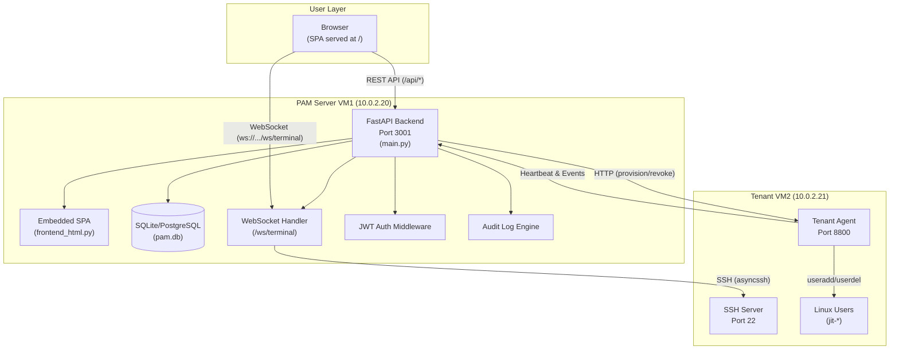

# Architecture Overview — PAM Console

> Generated from codebase snapshot at `/home/administrator/pam-server/`  
> Describes the system as designed and implemented

---

## 1. High-Level Architecture

The PAM (Privileged Access Management) Console is a multi-tenant platform that brokers SSH access between human users and target servers. It replaces static SSH key management with just-in-time (JIT) provisioned access, complete with session recording, suspicious activity detection, and audit logging.



**Component roles:**

| Component | Role |
|-----------|------|
| **FastAPI Backend** | HTTP REST API (49 endpoints), WebSocket SSH proxy, authentication, authorization, session management, audit logging, billing, notifications |
| **Embedded SPA** | Single-page application delivered as a raw HTML string at `GET /` — all UI logic in vanilla JavaScript (1342 lines) |
| **Database** | SQLite (dev) or PostgreSQL (production) — 11 tables: companies, users, servers, requests, sessions, audit_logs, billing_accounts, billing_transactions, notifications, agents |
| **Tenant Agent** | HTTP service on each managed server — handles Linux user provisioning, revocation, and event reporting back to the PAM Server |
| **SSH Target** | The actual Linux server being managed — SSH access is brokered through the PAM Server's WebSocket proxy |

---

## 2. Technology Stack

| Layer | Technology | Version | Why Chosen |
|-------|-----------|---------|------------|
| **Backend runtime** | Python 3.11+ | 3.11-slim | Developer familiarity, rich async ecosystem, quick prototyping |
| **Web framework** | FastAPI | Latest | Native async support, automatic OpenAPI docs, Pydantic integration, WebSocket support built-in |
| **ORM** | SQLAlchemy (async) | 2.x | Mature ORM with async support, works with both SQLite and PostgreSQL, composable query building |
| **Database (dev)** | SQLite + aiosqlite | — | Zero-config, file-based, no server process needed for development |
| **Database (prod)** | PostgreSQL 16 + asyncpg | 16 Alpine | Production-grade, concurrent access, no write-lock contention |
| **Auth** | python-jose + bcrypt | — | JWT for stateless auth, bcrypt (cost 12) for password hashing |
| **SSH proxy** | asyncssh | 2.23.1 | Pure-Python async SSH client, supports key-based auth, process execution |
| **HTTP client** | httpx | Latest | Async HTTP client for agent callbacks, connection pooling |
| **Frontend (live)** | Vanilla JS SPA | — | No build step, zero dependencies, served directly by FastAPI |
| **Frontend (source)** | React 18 + TypeScript + Vite + Tailwind CSS 3 | 18/5/3 | Component-based UI, type safety, hot-reload dev server |
| **Terminal (React)** | xterm.js 5.3 + xterm-addon-fit | 5.3 | Canvas-based terminal emulator with ANSI color support, cursor blink, resize handling |
| **Tunnel** | localhost.run SSH reverse tunnel | — | Free public URL for demo access without DNS/SSL setup |
| **Containerization** | Docker + Docker Compose | — | Consistent environment, multi-service orchestration, health checks |

**State management in the embedded SPA** uses global JavaScript variables (`user`, `token`, `companies`, `servers`, `requests`). Each page render function replaces the `#content` div's innerHTML and re-attaches inline event handlers. This was a deliberate choice to eliminate the frontend build pipeline while preserving full SPA behavior.

---

## 3. Directory Structure

```
pam-server/
│
├── backend-python/                    # Python/FastAPI backend
│   ├── main.py                        # Entry point, all 49 REST endpoints, WebSocket terminal handler,
│   │                                  #   suspicious activity detection, agent provisioning callbacks,
│   │                                  #   session recording, file download endpoints
│   ├── database.py                    # SQLAlchemy model definitions (11 tables), engine configuration,
│   │                                  #   custom UUIDType and ListType column types
│   ├── schemas.py                     # Pydantic models (12 request/response schemas)
│   ├── auth_utils.py                  # JWT creation/verification, bcrypt hashing/verification
│   ├── config.py                      # Environment variable loading with defaults
│   ├── frontend_html.py               # Embedded SPA (1342 lines): HTML + CSS + vanilla JS,
│   │                                  #   served as a raw Python string at GET /
│   ├── seed.py                        # Database seeder: 2 companies, 7 users, 1 server, 1 agent, billing
│   ├── serve.py                       # Uvicorn launcher script (reads PORT env var)
│   └── pam.db                         # SQLite database file (auto-created, tracked for convenience)
│
├── frontend/                          # React/TypeScript frontend source (unbuildable on this VM)
│   ├── src/
│   │   ├── App.tsx                    # React Router route definitions (13 routes)
│   │   ├── AuthContext.tsx            # Auth state provider (login, logout, refresh, route guard)
│   │   ├── api.ts                     # Typed API client (38 exported functions)
│   │   ├── types.ts                   # TypeScript interfaces (12 entity types)
│   │   ├── main.tsx                   # ReactDOM entry point with BrowserRouter
│   │   ├── index.css                  # Tailwind CSS directives
│   │   ├── components/
│   │   │   └── Layout.tsx             # Sidebar + header layout, role-based nav filtering
│   │   └── pages/                     # 12 page components
│   │       ├── LoginPage.tsx          # Login form with show/hide password, loading state
│   │       ├── DashboardPage.tsx      # Stats cards, charts, activity feed
│   │       ├── CompanyTenantsPage.tsx # Company CRUD (superuser only)
│   │       ├── UserRegistryPage.tsx   # User management (admin/superuser)
│   │       ├── ServerManagementPage.tsx # Server list, detail, access request
│   │       ├── MyRequestsPage.tsx     # Request tab filter, connect/cancel actions
│   │       ├── PendingApprovalsPage.tsx # Approve/reject pending requests
│   │       ├── SessionWindowPage.tsx  # xterm.js WebSocket terminal (334 lines)
│   │       ├── SessionRecordingsPage.tsx # Recorded session list with replay
│   │       ├── AuditLogsPage.tsx      # Paginated audit log with CSV export
│   │       ├── SettingsPage.tsx       # Change password/username, billing info
│   │       └── NotificationsPage.tsx  # Notification list with read/unread
│   ├── package.json                   # npm dependencies (react, xterm, recharts, tailwind, etc.)
│   ├── vite.config.ts                 # Vite configuration with API proxy
│   ├── tsconfig.json                  # TypeScript compiler options
│   ├── postcss.config.js              # PostCSS config for Tailwind
│   └── tailwind.config.js             # Tailwind CSS theme customization
│
├── docker-compose.yml                 # Defines postgres, backend, frontend services with networking
├── Dockerfile.backend                 # SQLite Docker image (python:3.11-slim, aiosqlite)
├── Dockerfile.backend-pg              # PostgreSQL Docker image (adds gcc, libpq-dev, asyncpg)
├── Dockerfile.frontend                # Multi-stage: Node 20 builds React, Nginx Alpine serves it
├── nginx.conf                         # Reverse proxy: static files, /api proxy, WebSocket upgrade
├── start.sh                           # Startup script: pkill → uvicorn → health check → localhost.run tunnel
├── tunnel.py                          # Python equivalent of start.sh (subprocess-based, prints public URL)
└── README.md                          # Project documentation with quick start and API overview
```

---

## 4. End-to-End Data Flow: Access Request Lifecycle

### Step 1: User Requests Access

```
Browser (SPA)                          FastAPI Backend                    Database
    │                                      │                                │
    │  POST /api/requests                  │                                │
    │  {server_id, access_level,           │                                │
    │   duration_minutes}                  │                                │
    │─────────────────────────────────────>│                                │
    │                                      │── select(Server) ─────────────>│
    │                                      │<── server found ──────────────│
    │                                      │── INSERT Request ────────────>│
    │                                      │   status: pending              │
    │                                      │── INSERT AuditLog ───────────>│
    │                                      │   event_type: request_created  │
    │                                      │── INSERT Notification ───────>│
    │                                      │   (to admins)                  │
    │  {id, status: "pending"}             │                                │
    │<─────────────────────────────────────│                                │
```

The frontend validates the server is visible to the user, then POSTs to `/api/requests`. The backend:
1. Verifies the JWT token from the `?token=` query parameter
2. Looks up the server by ID — returns 404 if not found, 400 if inactive, 403 if different company
3. Creates a `Request` record with `status = "pending"` and a randomly generated ID (UUID)
4. Records an audit log entry (`request_created`)
5. Notifies all admins and superusers via `Notification` records and WebSocket push
6. Returns the request ID and status to the frontend

### Step 2: Admin Approves the Request

```
Admin Browser                          FastAPI Backend                    Database          Tenant Agent (VM2)
    │                                      │                                │                    │
    │  POST /api/requests/{id}/approve     │                                │                    │
    │─────────────────────────────────────>│                                │                    │
    │                                      │── select(Request) ───────────>│                    │
    │                                      │<── pending request ──────────│                    │
    │                                      │── UPDATE status=approved ────>│                    │
    │                                      │   + approved_at, expires_at   │                    │
    │                                      │── INSERT AuditLog ───────────>│                    │
    │                                      │   event_type: request_approved│                    │
    │                                      │── INSERT Notification ───────>│                    │
    │                                      │   (to requester)              │                    │
    │                                      │                                │                    │
    │                                      │── POST /agent/provision ──────────────────────────>│
    │                                      │   {request_id,                │                    │
    │                                      │    username_to_create:         │                    │
    │                                      │      "jit-a1b2c3d4",          │                    │
    │                                      │    privilege,                  │                    │
    │                                      │    duration_minutes}           │                    │
    │                                      │                                │                    │── useradd jit-a1b2c3d4
    │                                      │                                │                    │── ssh-keygen -t rsa ...
    │                                      │<── 200 OK {username, ssh_private_key} ────────────│
    │                                      │                                │                    │
    │                                      │── UPDATE provisioned_username ─>│                    │
    │                                      │   provisioned_at,             │                    │
    │                                      │   ssh_private_key             │                    │
    │                                      │── INSERT AuditLog ───────────>│                    │
    │                                      │   event_type: agent_provisioned│                    │
    │  {message: "Request approved"}       │                                │                    │
    │<─────────────────────────────────────│                                │                    │
```

The approval flow:
1. Admin clicks "Approve" in the Pending Approvals page
2. Backend validates the admin is authenticated and not a `user` role
3. The request status is set to `approved` with an expiry time (`requested_at + duration_minutes`)
4. An audit log entry is created
5. The requester is notified
6. **Agent provisioning** — the backend calls `POST http://10.0.2.21:8800/agent/provision` on the tenant VM:
   - Generates a JIT username: `jit-` + 8 random hex chars (e.g., `jit-a1b2c3d4`)
   - Sends the provisioning request with the desired privilege level and duration
   - The tenant agent creates the Linux user, generates an SSH key pair, and returns the private key
   - The backend stores the provisioned username, timestamp, and SSH private key on the request record
7. The admin receives a success response

### Step 3: User Connects via Terminal

```
Browser (SPA)                    FastAPI Backend                DB          Tenant VM (10.0.2.21)
    │                                │                          │                │
    │  WebSocket connect             │                          │                │
    │  ws://host/ws/terminal?token=  │                          │                │
    │───────────────────────────────>│                          │                │
    │                                │── verify JWT ────────────│                │
    │  {type:"session_created"}      │                          │                │
    │<───────────────────────────────│                          │                │
    │                                │                          │                │
    │  {action:"join_session",       │                          │                │
    │   requestId, serverId}         │                          │                │
    │───────────────────────────────>│                          │                │
    │                                │── select(Server) ───────>│                │
    │                                │── select(Request) ──────>│                │
    │                                │   (get ssh_private_key,  │                │
    │                                │    provisioned_username) │                │
    │                                │                          │                │
    │                                │── INSERT Session ───────>│                │
    │                                │                          │                │
    │  {type:"ssh_ready"}            │                          │                │
    │<───────────────────────────────│                          │                │
    │                                │                          │                │
    │                                │══ asyncssh.connect ════════════════════>│
    │                                │   {host, port,            │                │
    │                                │    username:              │                │
    │                                │      "jit-a1b2c3d4",      │                │
    │                                │    client_keys: [tmpkey]} │                │
    │                                │                          │                │
    │                                │══ create_process() ════════════════════>│
    │                                │   (opens PTY on target)  │                │
    │                                │                          │                │
    │  ┌─────────────────────────┐   │                          │                │
    │  │ Terminal I/O Loop       │   │                          │                │
    │  │                         │   │                          │                │
    │  │ type: "terminal_input"  │   │                          │                │
    │  │ {data: "whoami\n"}      │   │                          │                │
    │  │─────────────────────────>──>│── stdin_w.write ───────────────────────>│
    │  │                         │   │                          │                │
    │  │                         │   │── detect_suspicious ─────│                │
    │  │                         │   │── log_audit if match ────>│                │
    │  │                         │   │── append recording ─────>│                │
    │  │                         │   │                          │                │
    │  │ type: "terminal_output" │   │                          │                │
    │  │ {data: "jita1b2\n"}     │   │                          │                │
    │  │<─────────────────────────<──│<── stdout_r ───────────────────────────│
    │  │                         │   │                          │                │
    │  │                         │   │── mask_ssh_keys ─────────│                │
    │  │                         │   │── detect_suspicious ─────│                │
    │  │                         │   │── log_audit if match ────>│                │
    │  │                         │   │── append recording ─────>│                │
    │  └─────────────────────────┘   │                          │                │
```

The terminal connection flow:
1. The SPA opens a WebSocket to `ws://10.0.2.20:3001/ws/terminal?token=<jwt>`
2. The backend verifies the JWT and stores the WebSocket in `active_connections`
3. The client sends `join_session` with the approved request ID and server ID
4. The backend creates a `Session` record in the database with `status = "active"`
5. The backend establishes an SSH connection to the target server using either:
   - The provisioned user's SSH private key (from the database), or
   - The shared deploy key (`/home/administrator/.ssh/id_rsa`) with username `pam-service`
6. `asyncssh.connect()` is called with `known_hosts=None` (accepts any host key) and a 10-second timeout
7. `conn.create_process()` opens a shell on the target — returns `(stdin_w, stdout_r, stderr_r)` streams
8. **Recording** — every character sent and received is appended to a `recording` array as `{timestamp, event, data}` objects
9. **Suspicious activity detection** — both input and output are scanned against 19 regex patterns (sudo, curl|sh, base64|bash, fork bomb, disk destruction, etc.). Matches create `critical` audit log entries
10. **SSH key masking** — any SSH private key text in the output is replaced with `[SSH KEY REDACTED]` before being forwarded to the client or stored in the recording
11. **Session timer** — the SPA polls every second to check `expires_at`; the backend also checks expiry in a 1-second loop inside the terminal handler. When time runs out, the session is terminated automatically
12. On disconnect, the recording is saved to the `Session.recording_data` column and the session status is set to `ended`

### Step 4: Session Ends and User is Revoked

When the session expires or is manually terminated:

```
Terminate Trigger                    FastAPI Backend                    DB          Tenant Agent
    │                                      │                          │                │
    │  Manual: POST /api/sessions/{id}     │                          │                │
    │  /terminate                          │                          │                │
    │  Timer: expires_at <= now            │                          │                │
    │─────────────────────────────────────>│                          │                │
    │                                      │── UPDATE Session ─────────>│                │
    │                                      │   status=terminated, ended_at │              │
    │                                      │── INSERT AuditLog ───────>│                │
    │                                      │   event_type:              │                │
    │                                      │   session_terminated       │                │
    │                                      │                          │                │
    │                                      │-- DELETE /agent/revoke ──────────────────>│
    │                                      │   {request_id,            │                │
    │                                      │    username:               │                │
    │                                      │    "jit-a1b2c3d4"}        │                │
    │                                      │                          │                │── userdel jit-a1b2c3d4
    │                                      │                          │                │
    │  WebSocket close                     │                          │                │
    │<─────────────────────────────────────│                          │                │
    │                                      │                          │                │
    │  Background: expire_old_requests()   │                          │                │
    │  runs every 60s                      │                          │                │
    │                                      │── SELECT expired ────────>│                │
    │                                      │── UPDATE status=expired ──>│                │
    │                                      │── POST /agent/revoke ──────────────────>│
```

Two revocation mechanisms:
1. **Manual/admin termination** — `POST /api/sessions/{id}/terminate` sets the session to `terminated`, marks the associated request as `expired`, and calls `agent_revoke()` which sends `POST /agent/revoke` to the tenant VM
2. **Background expiry check** — `expire_old_requests()` runs every 60 seconds as an asyncio task. It finds all approved requests where `expires_at <= now`, marks them `expired`, and sends revocation requests

---

## 5. Design Principles

### 5.1 Multi-Tenant Isolation by `company_id`

Every database query that returns data to a non-superuser includes a `company_id` filter. The `company_id` is extracted from the JWT payload and applied at the query level:

```python
# Common pattern across all endpoints (e.g., main.py line 709-710):
if payload["role"] != "superuser":
    query = query.where(Server.company_id == get_user_id(payload["company_id"]))
```

Three role tiers enforce the isolation:
- **superuser**: can see all companies' data (no filter)
- **admin**: sees only their own company's data
- **user**: sees only their own company's servers and their own requests

### 5.2 Just-in-Time (JIT) Access

SSH access is not persistent. Instead:
- Users submit access requests specifying server, duration, and privilege level
- An admin must approve each request before access is granted
- Upon approval, the backend calls the tenant agent to create a temporary Linux user (username prefix: `jit-`)
- The user can only connect while the request is approved and not expired
- When the request expires or is cancelled, the agent removes the Linux user
- SSH keys are generated per-request and discarded after use

This eliminates standing SSH key management — there is no permanent SSH key file that an employee could take when leaving the organization.

### 5.3 Audit-First Logging

Every meaningful action writes to the `audit_logs` table:

```python
async def log_audit(db, event_type, performed_by, target=None,
                    action_detail=None, company_id=None, security_status="info"):
```

Events logged include:
- Authentication: `login`, `login_failed`, `password_change`, `username_change`
- Resource management: `company_created`, `company_deleted`, `server_created`, `server_deleted`, `user_created`, `user_status_change`
- Request lifecycle: `request_created`, `request_approved`, `request_rejected`, `request_expired`, `request_cancelled`, `request_deleted`
- Sessions: `session_terminated`
- Security: `suspicious_command`, `suspicious_output`
- Agent: `agent_registered`, `agent_provisioned`
- Financial: `billing_funds_added`
- System: `system_init`

Each audit log entry carries a `security_status` (info/warning/critical) for filtering and alerting.

### 5.4 Stateless Authentication with JWT

The system uses a two-token JWT strategy:
- **Access token** (15-minute expiry) — short-lived, sent on every request
- **Refresh token** (7-day expiry) — long-lived, stored separately, used to obtain new access tokens without re-authentication

Passwords are hashed with bcrypt at cost factor 12, ensuring that even if the password hash column is compromised, the original passwords cannot be recovered through brute force.

### 5.5 Agent-Server Trust via HMAC Signing

Communication between the PAM Server and tenant agents is authenticated with:
- `X-API-Key` header — identifies the company
- `X-Signature` header — HMAC-SHA256 of the request body, signed with the API key

The backend verifies signatures using `hmac.compare_digest()` which provides timing-safe comparison:

```python
expected = hmac.new(api_key.encode(), body_bytes, hashlib.sha256).hexdigest()
if not hmac.compare_digest(expected, signature):
    raise HTTPException(401, "Invalid HMAC signature")
```

### 5.6 Session Recording with Replay

Every keystroke during an SSH session is captured as a timestamped JSON event:

```python
recording.append({"timestamp": 1234567890.123, "event": "output", "data": "whoami\n"})
recording.append({"timestamp": 1234567890.234, "event": "input", "data": "root\n"})
```

The recording is stored in the database as a JSON array and can be replayed through the frontend's replay viewer, which walks through the events with timed delays matching the original pacing (minimum 15ms between entries).

### 5.7 Suspicious In-Session Detection

Both terminal input and output are scanned in real-time against 19 regex patterns grouped by severity. All patterns are classified as `critical` and cover:

| Category | Example Commands |
|----------|-----------------|
| Privilege escalation | `sudo`, `su -`, `pkexec`, `doas`, `chmod +s`, `chmod 4777` |
| Remote code execution | `curl | bash`, `wget -O- | sh`, `base64 -d | bash` |
| Unauthorized installs | `apt-get install`, `pip install`, `npm install -g` |
| Destructive commands | `dd if=/dev/urandom of=...`, `mkfs`, `> /dev/sda` |
| Container escape | `docker run --privileged` |
| Fork bombs | `:(){ :|:& };:` |

Detection runs on every character received from or sent to the SSH session. Matches create audit log entries with `event_type: "suspicious_command"` or `"suspicious_output"`, linked to the session ID. Admins can terminate sessions directly from the audit log view.

### 5.8 Database-First Schema with Dual-Driver Support

The application is designed to work with both SQLite (development) and PostgreSQL (production). The `config.py` detects which database URL is configured and sets `IS_SQLITE` accordingly:

```python
DATABASE_URL = os.getenv("DATABASE_URL", "sqlite+aiosqlite:///./pam.db")
IS_SQLITE = DATABASE_URL.startswith("sqlite")
```

The SQLAlchemy engine uses different connect arguments based on this flag — SQLite needs `check_same_thread=False` for async access. The same ORM queries work against both databases without code changes, making development and production database switching seamless.

### 5.9 Role-Based Field Masking

Sensitive server fields (port, OS, allowed connection types) are hidden from `user` role accounts at the API response level:

```python
# main.py lines 720-721
if payload["role"] != "user":
    sd.update({"port": s.port, "os": s.os, "allowed_connection_types": s.allowed_connection_types})
```

This is enforced on both the list and detail endpoints, ensuring that users cannot discover connection details they don't have approved access to.

---

## 6. API Surface Overview

The backend exposes 49 endpoints organized into these groups:

| Group | Endpoints | Purpose |
|-------|-----------|---------|
| **Auth** (5) | `POST /api/auth/login`, `/refresh`, `/me`, `/change-password`, `/change-username` | Authentication, session management |
| **Dashboard** (2) | `GET /api/dashboard/stats`, `/user-stats` | Aggregated statistics per role |
| **Companies** (3) | `GET/POST/DELETE /api/companies` | Tenant company management (superuser) |
| **Agent** (3) | `POST /api/agent/register`, `/heartbeat`, `/events` | Agent lifecycle and event reporting |
| **Users** (4) | `GET /api/users`, `/users/all`, `POST /api/users`, `PATCH /api/users/{id}/status` | User management |
| **Servers** (4) | `GET/POST/DELETE /api/servers`, `GET /api/servers/{id}` | Target server management |
| **Requests** (9) | `GET/POST /api/requests`, `/my`, `POST /api/requests/{id}/approve/reject/cancel`, `DELETE /api/requests/{id}`, `GET /api/requests/check-active/{id}` | Access request lifecycle |
| **Sessions** (4) | `GET /api/sessions`, `GET /api/sessions/{id}`, `GET /api/sessions/{id}/recording`, `POST /api/sessions/{id}/terminate` | Session management and recordings |
| **Audit Logs** (2) | `GET /api/audit-logs`, `/export` | Audit trail viewing and CSV export |
| **Billing** (4) | `GET /api/billing/my`, `/transactions`, `/all`, `POST /api/billing/add-funds` | Billing management |
| **Notifications** (4) | `GET /api/notifications`, `/unread-count`, `PATCH /api/notifications/{id}/read`, `POST /api/notifications/read-all` | In-app notification system |
| **WebSocket** (1) | `ws://host/ws/terminal` | Real-time SSH terminal proxy |
| **Other** (4) | `GET /`, `/index.html`, `/api/health`, `/api/download-project` | Frontend serving, health check, project export |

---

## 7. Security Architecture Summary

| Layer | Mechanism |
|-------|-----------|
| **Transport** | HTTP/WebSocket with optional SSH tunnel TLS (localhost.run) |
| **Authentication** | JWT (HS256, 15min access tokens, 7-day refresh tokens) |
| **Password storage** | bcrypt, cost factor 12 |
| **Authorization** | Role-based (superuser/admin/user) with `company_id` scoping |
| **Agent trust** | API key + HMAC-SHA256 signature, timing-safe comparison |
| **In-session security** | Real-time regex pattern detection on input and output |
| **Recording** | Full terminal I/O captured as JSON, SSH keys masked before storage |
| **Audit** | All admin actions and security events logged with security classification |
